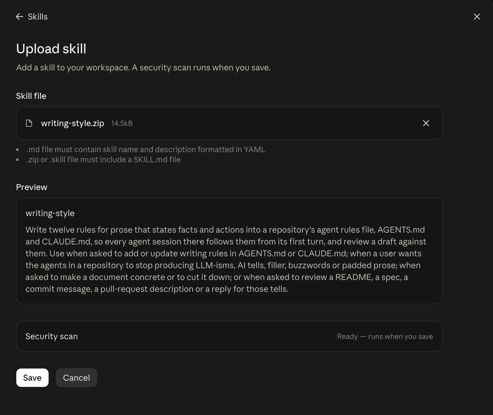

# Modaal agent skills

[](https://github.com/modaal-agent/skills/actions/workflows/ci.yml)

The [agent skills](https://code.claude.com/docs/en/skills) used at Modaal, published for anyone to
adopt. Each is a directory under `skills/` holding a `SKILL.md` the agent keeps resident once the
skill is invoked, and the `references/` files it opens only when it needs them.

They teach practices, not a product: how to write prose an engineer can act on, how to run a
spec-driven change by hand, how to set a repository up so an agent working in it has rules to
follow. Nothing in them assumes Modaal's internal tooling.

## Skills

Four skills, each a directory under `skills/`:

| skill | what it teaches |
| --- | --- |
| [`writing-style`](skills/writing-style/SKILL.md) | writes twelve rules for prose that states facts and actions into `AGENTS.md` and `CLAUDE.md`, and reviews a draft against them, with searches for filler, buzzwords and the tells of machine-written prose |
| [`spec-driven-development`](skills/spec-driven-development/SKILL.md) | writes the spec rules into `AGENTS.md` and `CLAUDE.md`, and the minimal manual flow: write the spec, review it, implement against it, commit under its slug. It covers the decision-record rule, which edits a spec in place while its feature is in progress and amends it by addition once the feature is done, and the external references a public repository can publish |
| [`repository-init`](skills/repository-init/SKILL.md) | what a new repository carries on day one: `AGENTS.md` and `CLAUDE.md` as one file in two places, the check and CI job that hold them identical, `README.md`, `CONTRIBUTING.md`, `SECURITY.md`, the license, the ignore file and `specs/` |
| [`git-discipline`](skills/git-discipline/SKILL.md) | writes four rules into `AGENTS.md` and `CLAUDE.md`: confirm every commit, leave the index alone, what a subject line says, and how a change reaches the default branch. It records the repository's default branch, merge strategy and branch names with the user |

Three of them, `writing-style`, `git-discipline` and `spec-driven-development`, write a section into
the adopting repository's `AGENTS.md` and `CLAUDE.md` when invoked. An agent reads that file from
its first turn, and reads a skill only once something invokes it, so the section is what holds the
agent to the rules. `repository-init` writes the files the sections go into.

The directory names carry no publisher prefix. If one collides with a skill already in
`~/.claude/skills/`, rename the directory and the `name:` in its `SKILL.md` together.

This repository follows the rules its skills teach, so [AGENTS.md](AGENTS.md),
[CONTRIBUTING.md](CONTRIBUTING.md) and the commit history are each a worked example of one of them.

### Skills published from their own repositories

Two skills Modaal publishes live beside the code generator they document, because a check in that
repository compares every member name and every diagnostic they quote against the generator's
source. Moving either one here would break that comparison.

| skill | repository |
| --- | --- |
| `kotlin-ksp-mocks` | [modaal-agent/kotlin-ksp-mocks](https://github.com/modaal-agent/kotlin-ksp-mocks) — build-time recording-spy mocks for Kotlin interfaces, generated by a KSP processor into the test compilation |
| `swift-sourcery-mocks` | [modaal-agent/swift-sourcery-templates](https://github.com/modaal-agent/swift-sourcery-templates) — Swift protocol mocks, type erasures and forwarding Components, generated by Sourcery templates |

## Install

Four channels, over one tree. The first three read `main`; the fourth reads a release.

**1. Any of ~75 agents, through the cross-agent CLI.** `-g` installs for every project on the
machine instead of this one; `--list` lists without installing.

```bash
npx skills add modaal-agent/skills
```

**2. As a Claude Code plugin.** The repository root is both the marketplace and the plugin:

```
/plugin marketplace add modaal-agent/skills
/plugin install modaal-skills@modaal-skills
```

**3. By hand.**

```bash
git clone https://github.com/modaal-agent/skills modaal-skills
cp -r modaal-skills/skills/* ~/.claude/skills/          # every skill, for every project
cp -r modaal-skills/skills/<name> .claude/skills/       # one skill, for this project alone
```

**4. claude.ai and the Claude desktop app, one archive per skill.** Neither installs from a
repository URL; both take a `.zip` upload. Every
[release](https://github.com/modaal-agent/skills/releases) carries `<name>.zip` for each skill, with
the skill directory as the archive's root, and a `SHA256SUMS` file listing their checksums.

1. Download the skill's archive from the latest release, such as
   [`writing-style.zip`](https://github.com/modaal-agent/skills/releases/latest/download/writing-style.zip).
2. In claude.ai or the desktop app, open **Skills**, and choose **Add** → **Upload skill**.
3. Drop the archive on **Skill file**, or browse to it. The dialog takes several archives at once.
4. Check the preview. It shows the `name` and `description` from the skill's `SKILL.md`.
5. Choose **Save**. A security scan runs on the skill when you save.



To upload a skill as it stands on `main`, between releases, run `scripts/package-skills.sh` in a
clone. It writes `dist/<name>.zip` for every skill, in the layout a release carries, and needs `git`
and `python3`.

The Skills API takes the same directories. Each skill's frontmatter carries only the Agent Skills
standard's keys, so `skills/<name>/` uploads unedited.

One plugin carries every skill here: a plugin reads the `skills/` directory inside its own root, so
a plugin per skill would need a separate nested root, and the other three channels want one flat
tree.

Channels 1–3 take a change when it lands on `main`, and [`ci.yml`](.github/workflows/ci.yml) runs the
checks before it lands. Channel 4 takes it from the next release: pushing a version tag runs
[`release.yml`](.github/workflows/release.yml), which runs the same checks again and publishes the
archives. [CHANGELOG.md](CHANGELOG.md) lists what each release changed.

## Layout

| path | what |
| --- | --- |
| `skills/<name>/SKILL.md` | the resident body an agent reads on invocation |
| `skills/<name>/references/*.md` | opened per task, not resident |
| `skills/<name>/scripts/`, `templates/` | a program the body runs, in bash and PowerShell, and the files it writes |
| `.claude-plugin/` | `marketplace.json` and `plugin.json` — the Claude Code channel |
| `scripts/check-skills.sh` | the skill checks, and `--self-test` for the checks themselves |
| `scripts/package-skills.sh` | one `.zip` per skill into `dist/`, the archives a release carries |
| `.github/workflows/ci.yml` | the `rules` job (`AGENTS.md` == `CLAUDE.md`) and the `skills` job |
| `.github/workflows/release.yml` | on a version tag: `ci.yml`'s jobs again, then a GitHub release carrying the archives |
| `CHANGELOG.md` | what each release changed |
| `specs/NNN-slug/spec.md` | the plan, the measurements and the decisions behind a change |
| `_assets/` | images this README shows |

## Contributing

[CONTRIBUTING.md](CONTRIBUTING.md) covers how a skill is added, what the checks hold it to, and how
a version is released.
[AGENTS.md](AGENTS.md) — the same file as [CLAUDE.md](CLAUDE.md) — carries the rules for an agent
working in this repository. Vulnerabilities go through [SECURITY.md](SECURITY.md).

## License

MIT — see [LICENSE](LICENSE).
